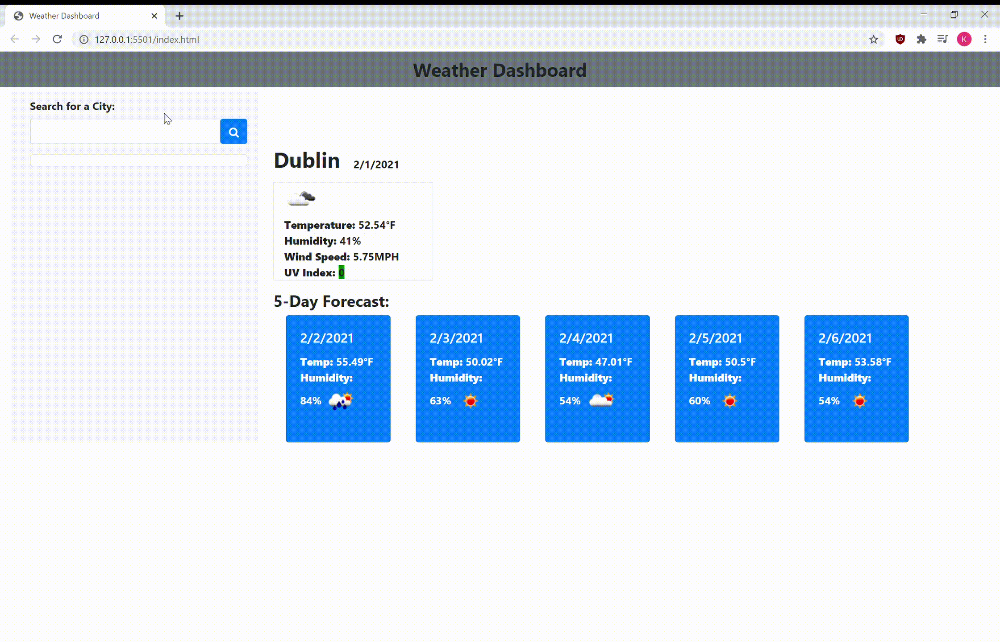

# Weather Dashboard

The weather dashboard features HTML, CSS and Javscript. Clients can input a city and the current as well as five day forecast will appear. The history of their search will appear on the left. 

# GitHub Repository

https://github.com/kierajcullen/weatherdashboard

# GitHub Live Site

https://kierajcullen.github.io/weatherdashboard/

# Webpage

